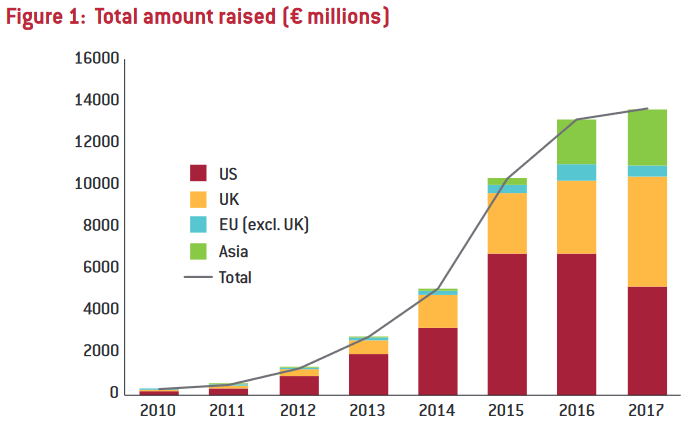

### Amount of Kickstarter projects per country

Let’s dive into geography for our second visualization! We created a Plotly choropleth map to show where projects originate worldwide. The interactive nature of this visualization allows you to hover over countries and zoom in, so feel free to explore!

```{r, message = FALSE, warning = FALSE, tidy = 'styler'}
library(plotly)
library(countrycode)

country.freq <- table(kickstarter$Country)
country.rel.freq <- round(country.freq / length(kickstarter$Country) * 100, digits = 2)

# dark grey boundaries
l <- list(color = toRGB("darkgray"), width = 0.5)

# specify map projection/options
g <- list(
    showframe = FALSE,
    showcoastlines = TRUE,
    coastlinecolor = toRGB("lightgray"),
    showland = TRUE,
    landcolor = toRGB("lightgray"),
    showocean = TRUE,
    oceancolor = toRGB("white"),
    showcountries = TRUE,
    countrycolor = toRGB("darkgray"),
    projection = list(type = "Mercator")
)

fig <- plot_geo(kickstarter)
fig <- fig %>% add_trace(
    z = log10(country.freq),
    color = log10(country.freq),
    text = paste("<b>Country:</b>", names(country.freq),
    "<br><b>Projects:</b>", format(country.freq, big.mark="'"),
    "<br><b>Relative:</b>", paste0(country.rel.freq, "%")
    ),
    locations = countrycode(names(country.freq), "country.name", "iso3c"),
    marker = list(line = l, type = "log"),
    hovertemplate = paste(
        "%{text}<extra></extra>"
    )
)

country.log_max_min <- seq(floor(log10(min(country.freq))), ceiling(log10(max(country.freq))), by = 1)

fig <- fig %>% colorbar(
    title = "Amount of projects",
    tickvals = country.log_max_min,
    ticktext = 10^country.log_max_min
)

m <- list(
  l = 0,
  r = 20,
  b = 0,
  t = 20,
  pad = 4
)

fig <- fig %>% layout(
    title = list(text = "Amount of Kickstarter projects per country", yanchor = "top"),
    width = 1000,
    margin = m,
    geo = g
)

fig
```

As shown by the colorbar on the right, we used a logarithmic scale because a significant majority of projects (~78%) originate in the USA. This is understandable, given that Kickstarter is an American company and crowdfunding is less commonly used in Europe (except the UK).
<br>
To provide additional context, we included a graphic from Bruegel, a European economics think tank [@bruegel2017], showing the total amount of money raised through crowdfunding (not limited to Kickstarter) by economic regions.
<br><br>

<br><br>
Although comparing the number of projects to the total amount raised isn’t a perfect comparison, it still highlights a correlation: the US is the largest crowdfunding market, while other regions (except the UK) remain much smaller as of 2017. Interestingly, the UK stands out as an anomaly in our Kickstarter dataset as well, with ~9% of projects originating there, placing it second after the USA.
