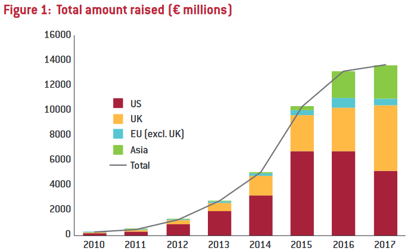

### 2. Amount of Kickstarter projects per country

Let's get geographical for our second visualization! Let's show where projects are created with a plotly choropleth map of the world. This allows the visualization to be interactive, so don't be afraid to hover over countries and zoom in:
```{r, message = FALSE, warning = FALSE, tidy = 'styler'}
library(plotly)
library(countrycode)

country.freq <- table(kickstarter$Country)
country.rel.freq <- round(country.freq / length(kickstarter$Country) * 100, digits = 2)

# dark grey boundaries
l <- list(color = toRGB("darkgray"), width = 0.5)

# specify map projection/options
g <- list(
    showframe = FALSE,
    showcoastlines = TRUE,
    coastlinecolor = toRGB("lightgray"),
    showland = TRUE,
    landcolor = toRGB("lightgray"),
    showocean = TRUE,
    oceancolor = toRGB("white"),
    showcountries = TRUE,
    countrycolor = toRGB("darkgray"),
    projection = list(type = "Mercator")
)

fig <- plot_geo(kickstarter)
fig <- fig %>% add_trace(
    z = log10(country.freq),
    color = log10(country.freq),
    text = paste("<b>Country:</b>", names(country.freq),
    "<br><b>Projects:</b>", format(country.freq, big.mark="'"),
    "<br><b>Relative:</b>", paste0(country.rel.freq, "%")
    ),
    locations = countrycode(names(country.freq), "country.name", "iso3c"),
    marker = list(line = l, type = "log"),
    hovertemplate = paste(
        "%{text}<extra></extra>"
    )
)

country.log_max_min <- seq(floor(log10(min(country.freq))), ceiling(log10(max(country.freq))), by = 1)

fig <- fig %>% colorbar(
    title = "Amount of projects",
    tickvals = country.log_max_min,
    ticktext = 10^country.log_max_min
)

m <- list(
  l = 0,
  r = 20,
  b = 0,
  t = 20,
  pad = 4
)

fig <- fig %>% layout(
    title = list(text = "Amount of Kickstarter projects per country", yanchor = "top"),
    width = 1000,
    margin = m,
    geo = g
)

fig
```

As you can see by the colorbar on the right we had to make the scale logarithmic, as the vast amount of projects (78%) are created in the USA. This makes sense, with Kickstarter being an american company but also with crowdfunding not being a commonly used form of funding in europe (except for the UK).
<br>
To illustrate this we have graphic showing total amount of money raised via crowdfunding (not just on Kickstarter) by economic regions created by Bruegel, a European economics think tank [@bruegel2017]:

<br>
While comparing amounts of projects with total amount raised isn't a perfect comparison, it still shows a correlation, with the US being the largest crowdfunding market, while the other regions (except for the UK) are much smaller as of 2017. Interestingly the anomaly of the UK can also be seen in our Kickstarter dataset with a relative amount of projects for the UK being 9%, landing it in second place after the USA of course.